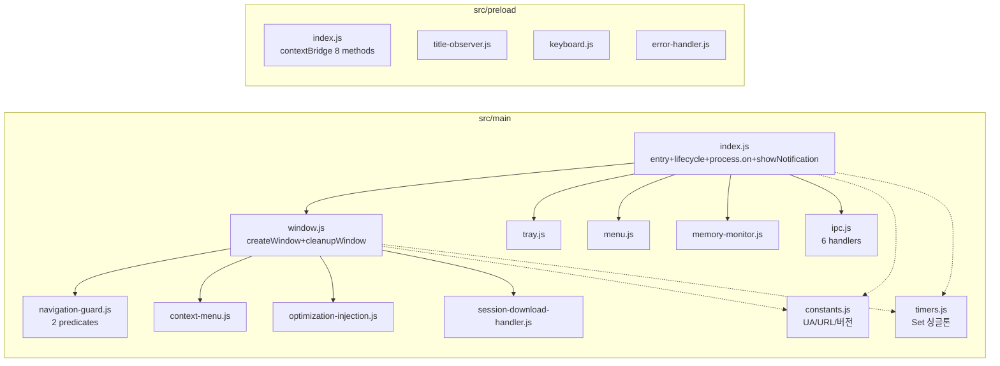

# ♻️ refactor: Modularize main.js and resolve technical debt

## Overview

단일 파일 `main.js`(832줄)와 `preload.js`(461줄)를 `src/main/`, `src/preload/` 다중 파일 구조로 분해하고, 직전 코드베이스 분석에서 발견된 기술 부채(의존성 부조하·데드 CI 잡·stale UA·잡동사니 파일)를 동시에 정리한다. end-user 가시 동작은 무결 보존하되, stale Chrome/120 UA 갱신과 `getAppVersion` 버그 수정은 의도적 행동 변경으로 포함. 버전 1.0.8 → 1.1.0.

> **brainstorm 이탈**: `src/shared/` 계층을 제거하고 constants/timers를 `src/main/`으로 이동. 근거: preload는 sandbox renderer라 Node timer 사용 불가, constants 미참조 → 진짜 cross-process 소비자 없음(기술 리뷰 F1 반박). src/main/, src/preload/ 2계층으로 단순화.

## Problem Statement / Motivation

현재 `main.js`는 단일 파일에 창 생성·트레이·메뉴·6개 IPC 핸들러·다운로드 핸들러·컨텍스트 메뉴·인젝션 스크립트·메모리 모니터·라이프사이클이 전부 뒤섞여 있다. `createWindow()` 단일 함수가 443줄. 함수 단위 테스트·병렬 개발·변경 영향도 파악이 어렵다. 추가로 분석에서 발견된 부채가 구조 개편과 무관하게 방치되고 있다: 사용처 없는 `@tauri-apps/cli` 의존성, jest 29.7 vs jsdom 30.2 메이저 불일치, schedule 트리거 없는 데드 CI 잡, Chrome/120 stale UA, dotenv 미사용인 `.env.example`, 런타임 무관 `.taskmaster/` 디렉토리. 구조 개편 작업과 부채 정리를 한 번에 수행해 두 번의 빌드 검증 사이클을 하나로 줄인다.

## Proposed Solution

2계층 분리(`src/main/` + `src/preload/`) + clean cutover. CommonJS 유지, ESM 전환 안 함(YAGNI). 인라인 `did-finish-load` 인젝션 스크립트(114줄)를 별도 파일로 추출. `timers`/`intervals` 글로벌 Set을 `src/main/timers.js` 싱글톤으로 이동(Node module cache로 다중 require 동일 인스턴스 보장). `package.json` main과 `build.extraMetadata.main`, `build.files`, lint/format 스크립트, `webPreferences.preload` 경로를 새 구조로 이동하고 루트 `main.js`/`preload.js`는 삭제. 부채 정리는 구조 작업 완료 후 별도 페이즈에서 수행해 리스크를 격리.

(see brainstorm: docs/brainstorms/2026-07-04-mainjs-modularization-brainstorm.md — `src/shared/` 제거만 이탈, 근거는 상기)

## Technical Approach

### Architecture

**파일 목록**(15개 신규): `src/main/{index,constants,timers,window,tray,menu,navigation-guard,context-menu,optimization-injection,session-download-handler,memory-monitor,ipc}.js` + `src/preload/{index,title-observer,keyboard,error-handler}.js`. `process-handlers.js`/`notifications.js`는 F7(9줄 이하)로 index.js에 흡수.

**의존성 방향**: main 내부 선형, 순환 없음. preload는 독립 컨텍스트(contextBridge sandbox). constants/timers는 main 전용(preload 미참조).

**contextBridge 무결성**: `src/preload/index.js`가 동일 8개 메서드(showNotification, hideWindow, openExternal, downloadFile, getAppVersion, getPlatform, getPerformanceInfo, requestMemoryCleanup)를 동일 시그니처로 노출. renderer 호환성 유지. 단, `getAppVersion` 반환값은 '1.0.0' → 실제 버전으로 변경(버그 수정, 하위 호환).

**글로벌 상태 접근**(M2 수정): `mainWindow`/`tray`는 `src/main/index.js` 모듈 스코프 변수로 보유. `state.js` getter/setter 계층 **미도입**(F3) — 기존 leak-fix 패턴(`BrowserWindow.getAllWindows().find(w => !w.isDestroyed())`, main.js:465/498/524)이 destroyed-but-not-null 위험 없이 항상 live window 반환하므로 tray/menu는 이 lookup 유지. window.js가 create 시점에 navigation-guard/context-menu/session-download-handler/optimization-injection factory에 mainWindow 인자로 전달(이미 `setupDownloadHandler(mainWindow)` 패턴 사용 중). `showNotification`은 index.js에서 정의 후 `createTray({ showNotification })`, `registerIpc({ showNotification })`로 factory 인자 전달.

### Implementation Phases

#### Phase 1: Extract modules (의존도 낮은 순)

Phase를 2개로 통합(F4). constants/timers 추출을 step 0으로 편입.

0. **`constants.js`** — `USER_AGENT`(갱신), `GOOGLE_CHAT_URL`, `WINDOW_OPEN_ALLOWED`(`['chat.google.com','google.com/chat']`), `NAVIGATION_ALLOWED_HOSTNAMES`(`['chat.google.com','google.com']`), 윈도우 config, `TRAY_TOOLTIP`. **주의**: 두 도메인 리스트는 **별도 상수**(M1 — setWindowOpenHandler와 will-navigate 허용 도메인이 상이, 통합 불가).
1. **`timers.js`** — `timers`/`intervals` Set + `trackTimer(fn,delay)`, `trackInterval(fn,delay)`, `clearAllTimers()`, `clearAllIntervals()`, `removeTimer(t)`, `removeInterval(i)`.
2. **`tray.js`** — `createTray({ showNotification })`. window 참조는 `getAllWindows().find()` lookup 유지(M2).
3. **`menu.js`** — `createMenu()`. window 참조 동일 lookup.
4. **`navigation-guard.js`** — **2개 predicate 별도 보존**(M1): `isAllowedWindowOpenUrl(url)`(substring, `google.com/chat` 포함, main.js:97 매칭) + `isAllowedNavigationUrl(parsedUrl)`(hostname, `google.com` 포함, main.js:203-204 매칭). `createWindowOpenHandler()` + `createNavigationHandler()` factory. 통합은 행동 변경 유발(인증 redirect 분기) → 불가.
5. **`context-menu.js`** — `createContextMenuHandler()` factory.
6. **`session-download-handler.js`** — `setupSessionDownloadHandler(mainWindow)`. webContents.session `will-download` 리스너, 한글 파일명 디코딩 포함. (명명 변경 m2: `download-handler.js`와 `ipc.js` downloads 헬퍼 충돌 회피)
7. **`optimization-injection.js`** — `initializeOptimizations`(114줄 함수) + `injectOptimizations(webContents)`. `.toString()` 주입 메커니즘 유지(did-finish-load timing + page-world 접근 보존 — M4 근거).
8. **`memory-monitor.js`** — `startMemoryMonitor()` → `trackInterval` 사용해 5분 인터벌 반환. **시작 시점 변경**(M5): module-load 동기 등록 → `app.whenReady` 후 시작(비동작 개선, 정상 케이스 동등).
9. **`window.js`** — `createWindow()` 본체. 위 모듈들 조합(mainWindow 인자로 전달). `cleanupWindow()` 포함.
10. **`ipc.js`** — 단일 파일(F2), `registerIpc({ getShowNotification })`가 6개 핸들러(show-notification, hide-window, open-external, download-file, get-memory-info, request-memory-cleanup) 순차 등록. `download-file`의 `chat.google.com`/`get_attachment_url` 분기 + 한글 디코딩은 사적 헬퍼로 동일 파일 내 보존(파일 추출 안 함 — F2).

- **Success**: 각 모듈 분리 후 `npm test` 통과(기존 183개). `node -e "console.log(require('./src/main/timers')===require('./src/main/timers'))"` → `true`(singleton identity, n1). 기존 main.js/preload.js 그대로 동작(영향 0 — 신규 모듈은 require만 되고 wiring은 Phase 2에서).

#### Phase 2: Wire entry + Clean cutover (atomic 단일 commit, m4)

- **`src/main/index.js`** 작성: commandLine switches, `app.whenReady` → createWindow+createTray+createMenu+startMemoryMonitor+registerIpc, lifecycle(`window-all-closed`, `before-quit` cleanup via `clearAllTimers`/`clearAllIntervals`/tray destroy/window removeAllListeners), `browser-window-blur`, `process.on('uncaughtException'/'unhandledRejection')`(2줄, process-handlers.js 미생성), `showNotification` 정의(9줄, notifications.js 미생성).
- **`src/preload/index.js`** + `src/preload/{title-observer, keyboard, error-handler}.js` 분리. contextBridge 8개 메서드 시그니처 불변.
- **package.json 갱신**(B1, B2, m1):
  - `"main": "src/main/index.js"`
  - **`build.extraMetadata.main`: `"src/main/index.js"`**(또는 extraMetadata 블록 제거) — **B1 critical**: electron-builder가 extraMetadata를 top-level main보다 우선 deep-merge하므로 미갱신 시 패키징된 앱 entry 부재 crash.
  - `build.files`: `["src/**/*", "index.html", "assets/**/*"]` — `package.json` 제거(m1, electron-builder가 항상 자동 포함)
  - `scripts.lint`: `"eslint src/ --ext .js"` — **B2**: 기존 `eslint main.js preload.js`는 삭제 후 "No files matching" fail
  - `scripts.format`/`format:check`: `"prettier --write \"src/**/*.js\" \"index.html\""` 및 check 동일 — **B2**
- **webPreferences.preload**: `path.join(app.getAppPath(), 'src', 'preload', 'index.js')`(n2 — `__dirname` 상대경로 대신 app root 기반, window.js 위치 종속 제거)
- 루트 `main.js`, `preload.js` **삭제**
- `jest.config.js` `collectCoverageFrom`: `['src/**/*.js', '!node_modules/**', '!tests/**']`
- `.eslintrc.js` `ignorePatterns`/`overrides` src/ 구조 점검
- **Atomic**: 이 phase는 단일 commit — 중간 상태(top-level main만 바꾸고 preload 경로 안 바꾸면) broken.

- **Success**:
  - `npm start` 정상 부팅 → Google Chat 로딩
  - **`npm run pack` 후 패키징된 앱 실제 실행**(B1 — dev 모드만으로는 extraMetadata 검증 불가): `dist/mac-*/Google Chat Desktop.app` 실행 → 정상 부팅
  - `npm run lint` + `npm run format:check` clean(B2)
  - `npm test` 통과

#### Phase 3: Debt cleanup (구조 작업과 분리)

- **package.json devDeps**:
  - `@tauri-apps/cli` 제거
  - `jest-environment-jsdom`: `^30.2.0` → `^29.7.0`(jest 29.7 정합)
  - `js-yaml` devDep + `overrides` 제거 → 즉시 `npm audit` 실행 → 취약점 재노출 시 override 복구
- **`.github/workflows/build-and-release.yml`**:
  - `update-dependencies` job 삭제(schedule 트리거 없는 데드 잡)
  - `codecov/codecov-action@v3` → `@v5`
  - `softprops/action-gh-release@v1` → `@v2`
  - Linux `upload-artifact`에서 `.deb`, `.rpm` 패턴 제거(AppImage만)
  - release 본문에서 `.deb`/`.rpm` 섹션 제거, "Linux (AppImage)"만 유지
- **UA 갱신**: `src/main/constants.js` `USER_AGENT`를 현재 Chrome stable(구현 시점 기준)으로 갱신. 형식: `Mozilla/5.0 (<platform>) AppleWebKit/537.36 (KHTML, like Gecko) Chrome/<stable> Safari/537.36`
- **잡동사니**: `.env.example` 삭제, `.taskmaster/` 삭제, `.gitignore` `.idea`/`.vscode` 중복 제거
- **버전 단일화 + getAppVersion 버그 수정**(m4 behavior-change tag): menu.js 하드코딩 "Version 1.0.8" → `app.getVersion()`. preload `getAppVersion` `process.env.APP_VERSION || '1.0.0'`(항상 '1.0.0' 반환 버그) → 실제 버전 반환. main에서 IPC 주입 또는 빌드 시 APP_VERSION 설정.
- **"붙여넣" 오타**(n3): main.js:585 menu "붙여넣" → **보존**(행동 보존 원칙; 오타 수정은 별도 사용자 가시 변경이므로 범위 외). known-typo로 문서화.
- **package.json version**: `1.0.8` → `1.1.0`
- **Success**: `npm audit` 0 취약점. `npm run lint` clean. UA 갱신 후 Google Chat 정상 로딩 확인.

#### Phase 4: Tests + Verification (행위별 고신호, F5)

- `jest.config.js` 커버리지 경로 갱신(Phase 2에서 수행, 여기서 재검증)
- **신규 단위 테스트 — 행위별 +10~15개**(F5, 모듈별 +30~50 아님):
  1. `isAllowedWindowOpenUrl` — 허용 도메인 수락 + 외부 거부 엣지(accounts.google.com은 window-open에서 외부 처리)
  2. `isAllowedNavigationUrl` — hostname 기준 허용/거부(window-open과 **다른** 결과 검증, M1 불일치 명시)
  3. `decodeFilename`(session-download-handler 사적 헬퍼 추출) — 유효 URI, malformed URI(catch branch), passthrough
  4. `USER_AGENT` 포맷 불변(regex)
  5. `trackTimer`/`trackInterval`/`clearAll*` — Set membership + clear 의미 + singleton identity
  - **제외**(hollow test 회피): window/tray/menu/context-menu/optimization-injection/ipc 전체 모듈 mock 테스트 — 이들은 기존 Integration Test Scenarios와 수동 스모크가 실제 Electron 동작으로 검증. snippet-based 기존 테스트의 hollowness 반복 방지.
- `tests/setup.js` electron mock 유지
- 수동 스모크(acceptance의 스모크 항목)
- `npm run quality` green
- **Success**: 신규 행위별 테스트 + 기존 183개 전부 통과. 3플랫폼 CI green(UA 갱신 커밋 푸시 후). `npm audit` 0.

## Alternative Approaches Considered

- **최소 분리(A)**: `main.js` + 평탄 `lib/`. 평탄하나 구조 개편 의도 대비 명확성 부족. 기각.
- **기능별 분리(B)**: `src/<feature>/`. 신규 기능 임박하지 않아 과도 분할. 기각.
- **Shim 진입점**: 루트 `main.js` 5줄 shim 유지. 빌드 설정 수정 최소화되나 구조적 일관성 부족. 기각(clean cutover 선택).
- **ESM 전환**: Electron 39 지원하나 전환 비용 > 이점, `require()` 전면 교체 필요. 기각(YAGNI).
- **`src/shared/` 3계층**(brainstorm 원안): preload 미참조 + sandbox로 Node timer 사용 불가 → cross-process 소비자 없음. 기각(기술 리뷰 F1).
- **navigation-guard 단일 predicate 통합**: `setWindowOpenHandler`(substring) vs `will-navigate`(hostname) 허용 도메인 상이 → 통합 시 accounts.google.com 인증 redirect 분기 변경. 기각(M1, 행동 보존 위반).
- **optimization-injection preload 이관**: contextIsolation으로 preload가 page-world electronAPI 접근 불가 + 매 navigation 재주입으로 인증 중간 페이지에 CSS 적용 → 로그인 UI 깨짐. 기각(M4, `.toString()` 보존 필수).
- **`src/main/ipc/` 서브디렉토리**(7 마이크로 파일): 5-12줄 forwarding stub당 파일 1개는 ceremony > code. 기각(F2, 단일 `ipc.js`).
- **`state.js` getter/setter 계층**: 기존 leak-fix `getAllWindows().find()` 패턴 퇴행 + destroyed-but-not-null 위험. 기각(F3/M2, factory 인자 주입).

## System-Wide Impact

### Interaction Graph

리팩터는 호출 그래프 변경 없음, 파일 위치만 이동. 기존: `app.whenReady → createWindow → loadURL → setWindowOpenHandler → setupSessionDownloadHandler → trackWebContentsHandler(will-navigate, context-menu, did-finish-load) → cleanupWindow on closed`. 리팩터 후 동일 시퀀스, 단 각 단계가 전용 모듈로 위임. `before-quit → clearAllTimers + clearAllIntervals + tray.destroy + window.removeAllListeners` 동일.

**memory-monitor 시작 시점 변경**(M5): module-load 동기 등록 → whenReady 후 시작. 정상 케이스(whenReady < 5분) 동등, 비정상(whenReady 지연) 시 더 안전(interval 자체 미생성). 비동작 개선.

### Error & Failure Propagation

index.js의 `process.on` 로거 무결. IPC 핸들러 에러 → renderer 미전파 패턴 유지. `memory-monitor` try/catch 무결. 변화 없음.

### State Lifecycle Risks

- **timers/intervals 싱글톤**(M3): `src/main/timers.js` 다중 require 시 Node module cache로 동일 Set 반환(Phase 1 identity 테스트로 검증). **주의 — inherited limitation**: `cleanupWindow`(per-window 의미)가 **global Set 전체** clear(main.js:399-408 현행 동작). 현재 단일창 + close 시 hide-only(app.isQuitting 아닐 시 preventDefault)이라 'closed' 미발화로 masking. 본 리팩터는 이를 **single-window 불변조건으로 상속** 명시 — per-window timer tracking 도입 안 함(YAGNI). 향후 다중창 확장 시 별도 부채.
- **`mainWindow`/`tray` 참조**(M2): `getAllWindows().find(w => !w.isDestroyed())` lookup이 항상 live window 반환 → destroyed-but-not-null 위험 없음. state.js getter 미도입.
- **contextBridge 시그니처**: 8개 메서드 시그니처/인자 수 변경 시 renderer 코드 호환 깨짐. 무결 유지 필수. 단, `getAppVersion` 반환값은 '1.0.0' → 실제 버전(버그 수정).

### API Surface Parity (m3 비대칭 명시)

- **contextBridge API**: 8개 메서드 시그니처 불변(preload/index.js)
- **IPC 채널명**: `show-notification`, `hide-window`, `open-external`, `download-file`, `get-memory-info`, `request-memory-cleanup` 불변
- **매핑 비대칭**(문서화):
  - 4 bridge method → 4 `ipcMain.on`(send): showNotification, hideWindow, openExternal, downloadFile
  - 4 bridge method → local-only(IPC 없음): getAppVersion, getPlatform, getPerformanceInfo, requestMemoryCleanup
  - 2 IPC channel → main-process-internal(`executeJavaScript` round-trip): get-memory-info, request-memoryCleanup — renderer가 아닌 main이 renderer 역호출(round-trip smell, 본 리팩터 범위 외)
- **electron-builder 설정**: `appId`, `productName` 불변, `main`/`extraMetadata.main`/`files`/preload 경로/lint+format scripts 변경

### Integration Test Scenarios

1. **앱 시작 → Chat 로딩**: `npm start` 후 창 표시, chat.google.com 로드, ready-to-show 발화. 미발화 시 3초 폴백 타이머 동작.
2. **트레이 토글 + 파괴 후 재생성**: 트레이 클릭 hide/show. 창 close 후 트레이 클릭 시 `createWindow()` 재호출.
3. **외부 링크 분기**(M1 불일치 명시): `setWindowOpenHandler` deny(substring, `google.com/chat`) + `will-navigate` prevent(hostname, `google.com`) — **두 predicate 다른 도메인 집합**. accounts.google.com은 will-navigate 허용, setWindowOpenHandler 외부.
4. **다운로드 핸들러 중복 등록 방지**: `downloadHandlerSetup` 플래그 유지. 창 재생성 시 기존 `will-download` 리스너 제거 후 재등록.
5. **before-quit 전체 정리**: 종료 시 timers/intervals/tray/windows 전부 정리. memory-monitor interval 좀비 잔류 없음(timers 싱글톤 정리로 방어).

## Acceptance Criteria

### Functional Requirements

- [ ] `npm start` 정상 부팅, Google Chat 로딩, 로그인 → 채팅 목록 → 메시지 송수신
- [ ] **패키징된 앱 실행**(B1): `npm run pack` 후 `dist/mac-*/Google Chat Desktop.app`(또는 타 플랫폼) 실행 → 정상 부팅. dev 모드만으로는 extraMetadata 검증 불가.
- [ ] 트레이: 아이콘 표시, 클릭 토글, 컨텍스트 메뉴, 창 파괴 후 재생성
- [ ] 외부 링크: 시스템 기본 브라우저에서 열림, 새 창 생성 안 됨
- [ ] 다운로드: 한글 파일명 디코딩, 기본 다운로드 폴더 저장, macOS 알림 + "폴더 열기" 다이얼로그
- [ ] 알림: title 변경 감지 시 네이티브 알림, 2초 디바운스
- [ ] 컨텍스트 메뉴: 잘라내기/복사/붙여넣기/전체선택/검색/링크열기
- [ ] 단축키: R/Shift+R/N/W/Q, F12(dev만)
- [ ] 종료: before-quit 정리(timers/intervals/tray/windows), 재시작 정상

### Non-Functional Requirements

- [ ] **UA 호환성 검증**: UA 갱신 후 Google Chat 정상 로딩(로그인 페이지 → 채팅 목록 → 메시지). 깨질 시 UA 원복.
- [ ] **getAppVersion 반환값 변경**(m4): '1.0.0' → 실제 버전(버그 수정, behavior change)
- [ ] 메모리 프로파일: before/after 시작 RSS, 5분 후 RSS 동등
- [ ] contextBridge API 8개 메서드 시그니처 불변(반환값은 getAppVersion만 변경)
- [ ] CommonJS 유지(`require()`)

### Quality Gates

- [ ] `npm test` 전체 통과(기존 183개 + 신규 행위별 단위 테스트 +10~15)
- [ ] **신규 단위 테스트 행위별**(F5): isAllowedWindowOpenUrl, isAllowedNavigationUrl, decodeFilename, USER_AGENT format, timers bookkeeping. 모듈 전체 mock 테스트 제외(hollow 회피).
- [ ] `jest.config.js` `collectCoverageFrom` 신규 경로 반영
- [ ] `npm run lint` + `npm run format:check` clean(B2 scripts 갱신 후)
- [ ] GitHub Actions 3플랫폼(macOS/Windows/Linux) 빌드 green
- [ ] `npm audit` 0 취약점 — js-yaml override 제거 후 재노출 시 override 복구
- [ ] before/after `git diff` 코드 리뷰

## Success Metrics

- 파일당 평균 줄수: main.js 832줄 → 가장 큰 모듈 `window.js` 예상 ~200줄 이하
- 테스트 수: 183개 → 183 + 행위별 ~10-15(F5)
- 신규 파일 수: 15개(src/main/ 12 + src/preload/ 4, F1-F3 단순화 후 — 원안 ~24개에서 절감)
- `npm run quality` 실행 시간: 회귀 없음
- 의존성 부채: `@tauri-apps/cli` 제거, jest/jsdom 정합, 데드 CI 잡 제거
- `npm audit` 취약점 수: 0 유지

## Dependencies & Prerequisites

- Node.js 18.x 이상(현행 유지)
- Electron 39.2.0(현행 유지, 업그레이드不在)
- 외부 API 신규 의존 없음
- git 작업 브랜치: `refactor/modularize-mainjs`(권장)

## Risk Analysis & Mitigation

| 위험 | 확률 | 영향 | 완화 |
|---|---|---|---|
| `build.extraMetadata.main` 미갱신 → 패키징된 앱 crash(B1) | 높음(누락 시) | 높음 | Phase 2에서 extraMetadata.main 갱신 필수 + 패키징된 앱 실행 검증(acceptance) |
| lint/format scripts 하드코딩 → Quality Gates 불가(B2) | 높음(누락 시) | 중 | Phase 2에서 scripts 갱신 필수 |
| `package.json` main/build.files 경로 오타로 빌드/시작 실패 | 중 | 높음 | Phase 2 후 즉시 `npm start` + `npm run pack` + 패키징된 앱 실행 검증 |
| navigation-guard 통합 시 인증 redirect 동작 변경(M1) | 중(통합 시) | 높음 | 2개 predicate 별도 보존, 통합 불가 명시 |
| UA 갱신 후 Google Chat 로딩 거부 | 중 | 높음 | acceptance UA 검증 항목, 깨질 시 원복(별도 커밋) |
| js-yaml override 제거 → 취약점 재노출 | 낮 | 중 | 제거 직후 `npm audit`, 재노출 시 override 복구 |
| preload 분리 시 contextBridge 동작 깨짐 | 낮 | 높음 | preload 경로 `app.getAppPath()` 기반, 스모크에서 8개 API 전부 호출 |
| timers 싱글톤 global clear — per-window 의미 깨짐(M3) | 낮(단일창) | 중 | single-window 불변조건으로 상속 문서화, per-window tracking 미도입(YAGNI) |
| 인젝션 `.toString()` 직렬화 깨짐 | 낮 | 중 | 동일 함수 본문 유지, did-finish-load timing 보존 |

## Documentation Plan

- [ ] `CHANGELOG.md`: 1.1.0 섹션 추가(Changed: 구조 개편·UA 갱신·getAppVersion 수정, Fixed: 부채 정리 항목별)
- [ ] `README.md`: File Structure 섹션 갱신(신규 디렉토리 구조), Architecture 섹션 갱신
- [ ] `CLAUDE.md`: Core Files Structure + Key Architecture Patterns 갱신(README와 중복 회피, 상호참조)
- [ ] `prd.md`: 변경 불필요(요구사항 수준, 구현 독립)

## Sources & References

### Origin

- **Brainstorm document**: [docs/brainstorms/2026-07-04-mainjs-modularization-brainstorm.md](docs/brainstorms/2026-07-04-mainjs-modularization-brainstorm.md) — Key decisions carried forward: 2계층 분리(`src/shared/` 제외, 리뷰 F1 반박), clean cutover, CommonJS 유지, 인라인 인젝션 추출, 부채 동시 정리, 버전 1.1.0
- **Technical review**: 2 background reviewers(architecture + simplicity) — 2 BLOCKER + 5 MAJOR + 5 simplification findings 반영(revision 2)

### Internal References

- 현행 메인 프로세스: `main.js:11-454`(createWindow), `main.js:456-510`(tray), `main.js:522-631`(menu), `main.js:740-822`(IPC), `main.js:95-102`(setWindowOpenHandler), `main.js:198-209`(will-navigate)
- 현행 프리로드: `preload.js:4-50`(contextBridge), `preload.js:86-173`(title observer)
- 빌드 설정: `package.json:50-110`(electron-builder, extraMetadata:63-65), `package.json:21-24`(lint/format scripts), `.github/workflows/build-and-release.yml`
- 테스트 인프라: `jest.config.js`, `tests/setup.js`

### External References

- Electron 보안 가이드라인: https://www.electronjs.org/docs/latest/tutorial/security
- Electron contextBridge: https://www.electronjs.org/docs/latest/api/context-bridge
- electron-builder files/extraMetadata: https://www.electron.build/docs/contents(pacakage.json + node_modules 자동 포함)

## Next Steps

→ `/workflows:work docs/plans/2026-07-04-refactor-modularize-mainjs-resolve-debt-plan.md` for 구현 시작.
